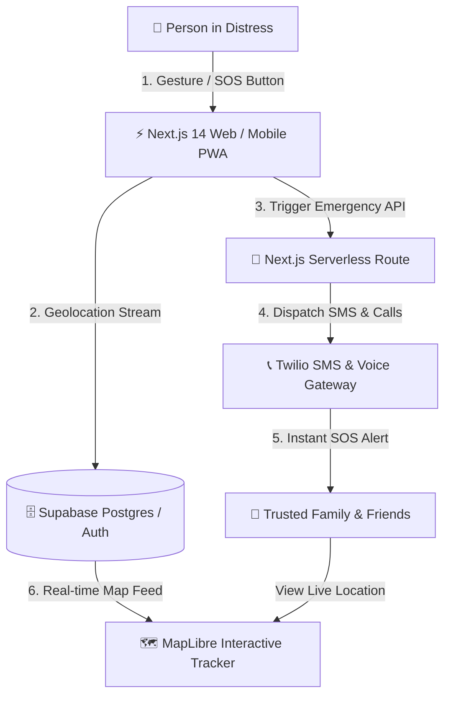

<!-- HEADER BANNER -->


# Sahaara

> A modern women’s safety platform with emergency SOS alerts, live location sharing, and trusted-contact notification workflows.


## Why Sahaara Exists

Emergency-response tools are often slow, complicated, or dependent on users manually typing messages during high-stress situations.

Sahaara focuses on:

- Fast SOS activation
- Real-time location visibility
- Trusted-contact notification systems
- Mobile-friendly emergency workflows
- Privacy-conscious design

The goal is to reduce friction during emergencies and create a more accessible safety-support experience.

---

## Key Features

### Emergency SOS Trigger
Users can activate an emergency alert flow that immediately starts the notification pipeline.

### Live Location Sharing
Trusted contacts can receive real-time location information to improve response coordination.

### Twilio Alert Integration
Emergency messages and alerts are delivered using Twilio communication services.

### Interactive Safety Mapping
MapLibre-powered map views provide location visualization and tracking workflows.

### Modern Full-Stack Architecture
Built with a scalable frontend stack using Next.js, TypeScript, Tailwind CSS, and Supabase.

---

## Tech Stack

| Layer | Technology |
|---|---|
| Frontend | Next.js, React, TypeScript |
| Styling | Tailwind CSS |
| Backend / BaaS | Supabase |
| Messaging | Twilio |
| Maps | MapLibre |
| Deployment | Vercel |

---

## Architecture Overview



---

## Local Setup

### Prerequisites

- Node.js 18+
- npm / pnpm / yarn
- Supabase project
- Twilio account

### Installation

```bash
git clone https://github.com/Shaan-alpha/Sahaara_APP.git
cd Sahaara_APP
npm install
```

### Environment Variables

Create a `.env.local` file:

```env
NEXT_PUBLIC_SUPABASE_URL=your_supabase_url
NEXT_PUBLIC_SUPABASE_ANON_KEY=your_supabase_key
TWILIO_ACCOUNT_SID=your_twilio_sid
TWILIO_AUTH_TOKEN=your_twilio_token
TWILIO_PHONE_NUMBER=your_twilio_phone
```

### Run Development Server

```bash
npm run dev
```

Open:

```text
http://localhost:3000
```

---

## Product Vision

Sahaara is designed as more than a messaging utility.

The long-term vision includes:

- gesture-based emergency activation
- AI-assisted risk detection
- offline-safe fallback workflows
- wearable integration
- emergency response escalation layers
- multilingual accessibility support

---

## Security & Privacy

- Sensitive credentials are managed through environment variables.
- Personal safety data should never be committed to Git.
- Production deployments should use HTTPS and secured API routes.
- Twilio and Supabase keys should be rotated periodically.

---

## Future Improvements

- Push notifications
- Background location updates
- Native mobile wrapper
- Contact verification workflows
- Incident timeline exports
- Emergency analytics dashboard

---

## License

MIT License
